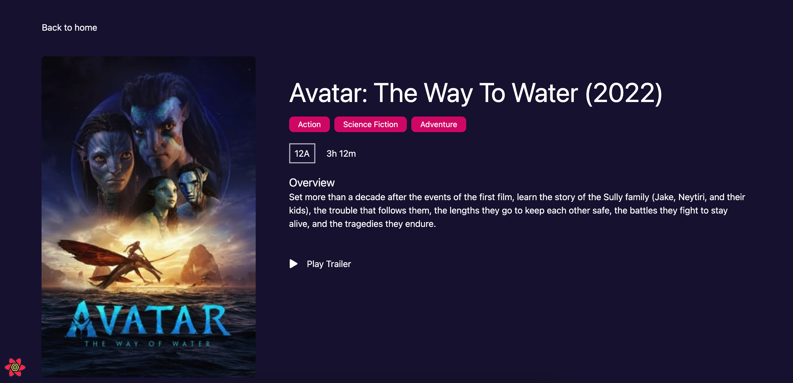
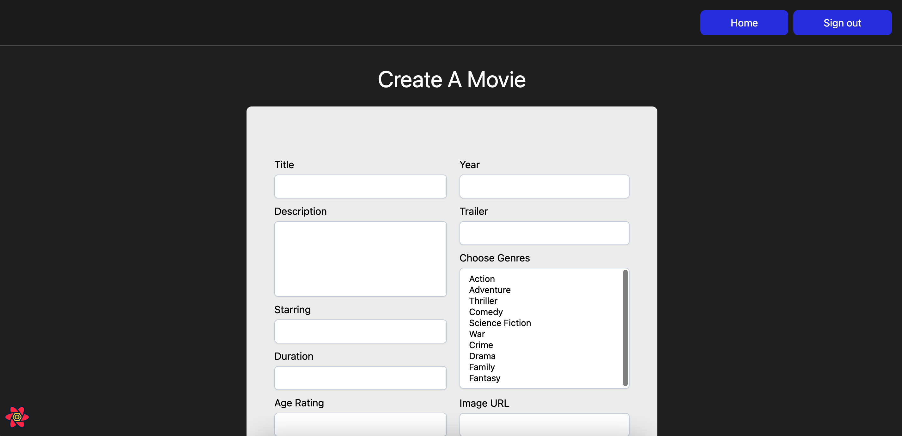
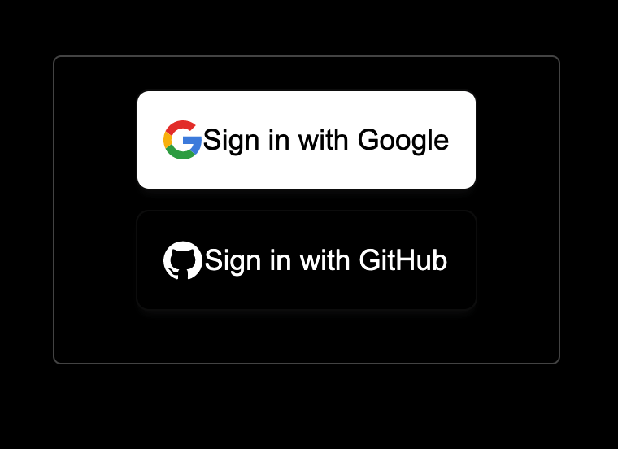
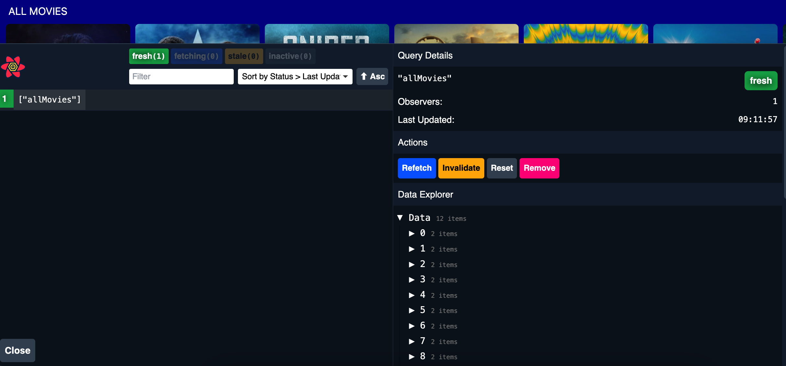

## Getting Started

Please first start the server at this repo https://github.com/renato76/movies-api-strapi

Then to run the frontend:

```bash
yarn

yarn dev

```

# **Overview**

This project has been setup using Next JS, TypeScript and React JS for the frontend, which consumes an API created with Strapi Headless CMS.

I used React Query for fetching all movies, and for creating a movie. For create a movie, also added invalidateQueries() into the onSuccess of the mutate function which refetch the latest data after a user successfully adds a new movie.

For the Create a Movie form I used Formik.

API Functionality includes: Read All Movies, Read One Movie, Create A Movie, Update A Movie.

I also added social login with GitHub and Google using Next Auth.

# **Next Steps**

- The plan is to have full CRUD functionality, so will be adding "Delete a movie" which will only be available to Authorized and Authenitcated users. I will add JWT token to the Headers in the fetch and modify the Strapi API to receive requests in such way.

- Refactor to use Next JS 13 Server / Client Components using the app folder

- Form fields validation.

- Web Accessibility for screen readers, checks on headings, lists, links, site navigation, images, form validation.

- Cypress E2E tests.

- Gitlab CI/CD Pipeline.

# **Screenshots**

## **Homepage:** 

<pre>
</pre>

## **Movie Details:** 

<pre>
</pre>

## **Add a Movie Form:** 

<pre>
</pre>

## **Naxt Auth:** 

<pre>
</pre>

## **React Query:** 

<pre>
</pre>

## **Strapi API:** 

<pre>
</pre>

## **Testing API with Insomnia:**

<pre>
</pre>

