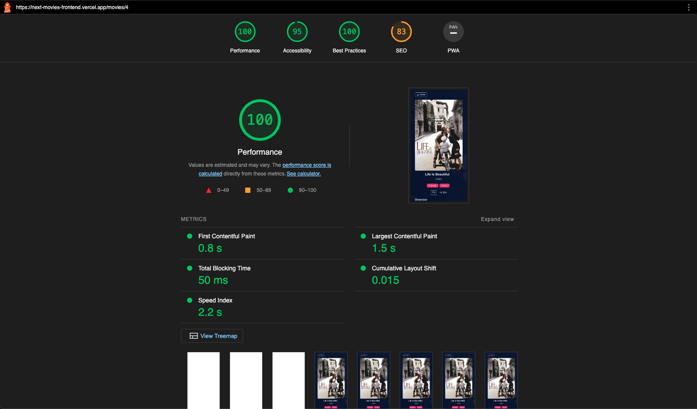

## Getting Started

Please first clone and start the server at this repo https://github.com/renato76/movies-api-strapi

Then to run the frontend:

```bash
yarn

yarn dev

```

# **Next Movies**

# **Overview** ☀️

I set this project up using Next JS, TypeScript and React JS for the frontend, which consumes an API created with Strapi Headless CMS.

I used React Query for fetching data from the API.

I used Formik to create the form for adding / updating a movie.

Current API Functionality includes:

- read all
- read one
- create one
- update one

For Authentication, I used Next Auth and implemented Social Login for Google and GitHub account users.

The backend or Strapi API has been deployed to Heroku with a Postgres Database. The frontend has been deployed to Vercel.

# **Tech Stack** 🚀

- React
- Next.js 13
- TypeScript
- Next Auth
- Tailwind CSS
- Formik
- React Testing Library
- Cypress
- GitLab
- Postgres
- Heroku
- Vercel

# **Next Steps** 🎯

- The plan is to have full CRUD functionality, so I will be adding "Delete a movie" functionality which will only be available to Authorized and Authenitcated users. I will add JWT token to the Headers in the fetch and modify the Strapi API to receive requests in such way.

- Refactor to use Next JS 13 Server / Client Components.

- Form fields validation.

- Improvements to Web Accessibility, Performance, SEO, Best Practices etc. Use Lighthouse to generate a report.

- Unit & Integration tests using React Testing Library

- Cypress E2E tests.

- Gitlab CI/CD Pipeline.

# **Screenshots** ⭐️

**Homepage:**


</br>

**Movie Details:**


</br>

**Add a Movie Form:**


</br>

**Naxt Auth:**


</br>

**React Query:**


</br>

**Strapi API:**


</br>

**Testing API with Insomnia:**


</br>

**Lighthouse Score:**

