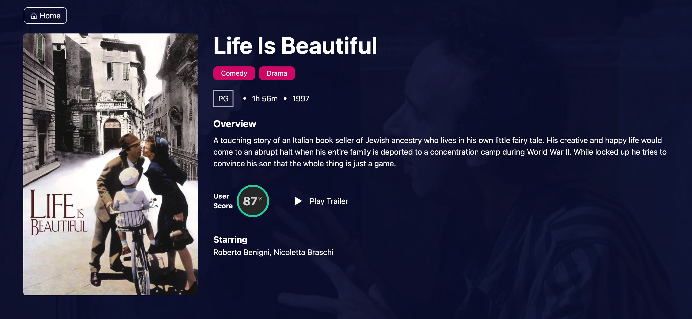

## Getting Started

Please first start the server at this repo https://github.com/renato76/movies-api-strapi

Then to run the frontend:

```bash
yarn

yarn dev

```

# **Overview**

This projetc has been setup using Next JS, TypeScript and React which consumes an API created with Strapi Headless CMS.

React Query has been used to fetch all the movies, and also invalidated the query to ensure we always have fresh data.

For styling I used Tailwind CSS.

Right now we have: Fetch all movies, and Fetch 1 movie by ID.

I also added social login with GitHub and Google using Next Auth.

# **Next Steps**

The plan is to have full CRUD functionality, so will be adding a Create / Update a movie plus Delete a movie which will only be available to Authrized and Authenitcated users. I will add JWT token to the Headers in the fetch and modify the Strapi API to receive requests in such way.

# **Screenshots**


Homepage


Movie Details


Next Auth


React Query


Strapi API
